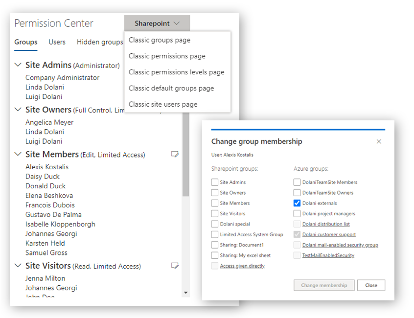

## SharePoint Permission Center web part

A modern SharePoint Online web part, released as open source under the [MIT License](https://choosealicense.com/licenses/mit/).

Documentation: https://sharepoint-permission-center.com/

The web part makes it easier for site owners and site users to answer the following questions:

- Who has access to a site collection and with what permission level?
- What are the members of a SharePoint group including members of nested Azure groups?
- Why is a person member of a particular group?
- What is the group nesting hierarchy of SharePoint and Azure groups?
- What (hidden) groups do exist from shared documents and folders in the site?
- What other (hidden) groups do exist without any assigned permission level?
- How can I navigate to the classic SharePoint pages to manage groups and permissions?



### Building the code
Ensure that [Node.js](https://nodejs.org/) V10.x is installed. On Windows, run ```ship.bat```. On other systems use

```bash
npm install gulp-cli -g
npm install
gulp clean
gulp build
gulp bundle --ship
gulp package-solution --ship
```

It outputs the file ```[PROJECT_DIR]\sharepoint\solution\permission-center-webpart.sppkg```.

### Testing the web part in the browser

On Windows, run ```run.bat```. On other systems use

```bash
npm install
gulp serve
```